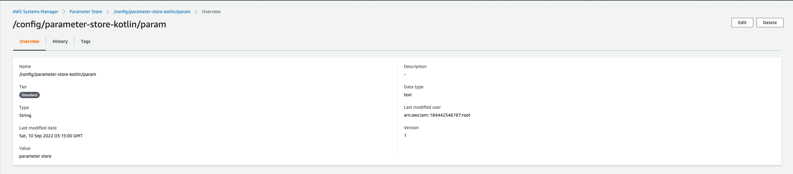

# parameter-store-kotlin

Example project to recovery parameters of AWS Parameter Store

## Stack
- [Kotlin](https://kotlinlang.org/) 1.6.21
- [Spring Boot](https://spring.io/projects/spring-boot/) 2.7.3
- [Spring Cloud](https://spring.io/projects/spring-cloud) 2021.0.4

## How to start

### Local
- No need any configuration
- No need internet
- Attribute param receive value `value local`

### Parameter Store
- Need variable AWS_ACCESS_KEY_ID
- Need variable AWS_SECRET_ACCESS_KEY
- Need variable AWS_REGION
- Configure parameter in [AWS Parameter Store](https://docs.aws.amazon.com/pt_br/systems-manager/latest/userguide/systems-manager-parameter-store.html)

